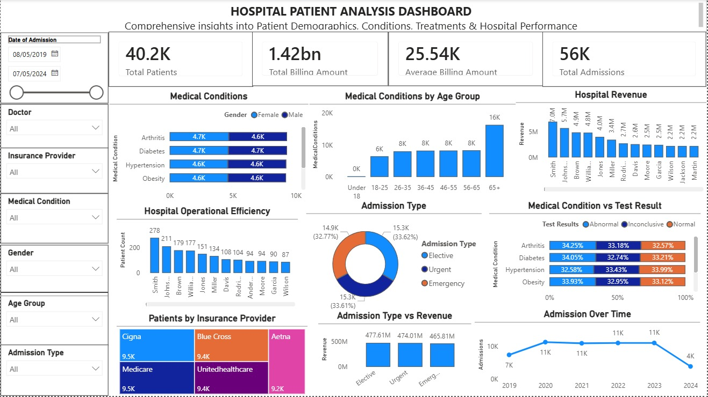

# Hospital-Patient-Data-Analysis

## Dashboard Overview
The dashboard provides a comprehensive analysis of hospital patient data, focusing on patient demographics, medical conditions, billing performance, insurance coverage, hospital workload, admission types, and admission trends over time. The dashboard monitors approximately 40.2K patients with a total billing amount of 1.42bn and an average billing amount of 25.54K. The visuals help evaluate healthcare delivery, operational efficiency, and financial performance across hospitals and patient groups.
## Patient Care Optimization
### Insights
- The most common medical conditions are Arthritis, Diabetes, Hypertension, Obesity, Cancer, and Asthma, with Arthritis and Diabetes recording the highest patient counts at approximately 9.3K cases each. This indicates that chronic diseases are the dominant healthcare burden within the hospitals.
- The “Medical Conditions by Age Group” chart shows that patients aged 56–65 and 65+ account for the highest number of medical condition cases, indicating that older adults are the most vulnerable patient group.
- The “Medical Condition vs Test Result” visual shows a relatively balanced distribution between Normal, Abnormal, and Inconclusive test results across major conditions. However, the presence of a significant percentage of abnormal and inconclusive outcomes suggests ongoing challenges in disease severity and diagnostic certainty.
### Recommendations
- Hospitals should strengthen chronic disease management programs for Diabetes, Hypertension, Arthritis, and Obesity through regular monitoring, specialist clinics, and long-term treatment plans.
- Preventive screening and early intervention programs should target older adults, particularly patients aged 56 years and above, to reduce disease complications and improve long-term outcomes.
- Healthcare providers should invest in improved diagnostic systems, laboratory technologies, and staff training to reduce inconclusive test results and improve treatment accuracy
## Hospital Resource Allocation
### Insights
- The “Hospital Performance by Volume” visual shows that some hospitals and doctors manage significantly higher patient volumes than others, indicating uneven workload distribution across healthcare facilities.
- The “Hospital Billing” chart reveals that certain hospitals generate substantially higher billing amounts, suggesting either higher patient traffic, more complex treatments, or higher operational costs.
- Admission volumes remain consistently high across the years 2020 to 2023, suggesting sustained pressure on hospital resources and staffing capacity.
### Recommendations
- Hospital management should allocate additional healthcare personnel, beds, and medical equipment to high-volume hospitals and departments to reduce overcrowding and service delays.
- Patient referral systems should be strengthened to distribute patient admissions more evenly across healthcare facilities and reduce operational pressure on overloaded hospitals.
- Workforce planning should be based on historical admission trends to ensure adequate staffing levels during peak patient periods.
## Insurance & Billing Strategy
### Insights
- Insurance providers such as Cigna, Medicare, Blue Cross, UnitedHealthcare, and Aetna each contribute a relatively similar patient share, ranging between approximately 9.2K and 9.5K patients.
- The “Billing Amount vs Admission Type” chart shows that billing amounts are relatively similar across Elective, Urgent, and Emergency admissions, although Elective admissions appear to generate slightly higher billing values.
- Hospitals with the highest patient volumes also appear to generate the highest billing amounts, indicating a direct relationship between patient traffic and revenue generation.
### Recommendations
- Hospitals should strengthen strategic partnerships with major insurance providers due to their significant contribution to patient coverage and hospital revenue.
- Billing monitoring systems should be improved to identify cost variations across admission types and hospitals, enabling better financial planning and cost management.
- Healthcare administrators should implement cost-control strategies for emergency and urgent care services to reduce financial strain on both hospitals and insurance providers.
- Preventive Health Focus
## Insights
- Older age groups, especially patients aged 56–65 and above, show the highest prevalence of chronic medical conditions, making them the most vulnerable demographic group.
- Chronic diseases such as Diabetes, Hypertension, Obesity, and Arthritis dominate the patient population, indicating lifestyle-related health risks within the population.
- The dashboard indicates continued high patient counts for preventable chronic conditions, suggesting a need for stronger preventive healthcare initiatives and community awareness programs.
### Recommendations
- Hospitals and public health agencies should implement community-based awareness campaigns focused on healthy lifestyles, nutrition, physical activity, and chronic disease prevention.
- Regular health screening programs for blood pressure, diabetes, obesity, and cancer detection should be expanded, especially for older adults and high-risk populations.
- Insurance providers and healthcare institutions should collaborate on wellness programs that encourage preventive healthcare and reduce long-term treatment costs.
- Operational Efficiency
## Insights
- Admission types are relatively balanced across Elective, Urgent, and Emergency categories, with each contributing approximately one-third of total admissions. This indicates that hospitals must maintain operational readiness across all admission categories.
- The “Admission Over Time” trend shows stable admission volumes from 2020 to 2023 before declining in 2024. The decline may indicate incomplete yearly data or changing patient utilization patterns.
- Sustained high admission volumes over multiple years suggest ongoing pressure on hospital operations, patient flow management, and healthcare capacity.
### Recommendations
- Hospitals should strengthen emergency response and triage systems to ensure timely treatment for urgent and emergency patients while maintaining efficient elective care operations.
- Historical admission trends should be used to improve capacity planning, inventory management, and operational forecasting.
- Healthcare facilities should invest in digital health technologies and workflow automation systems to improve patient processing speed, reduce waiting times, and enhance operational coordination.
## Overall Conclusion
The dashboard analysis reveals that chronic diseases such as Arthritis, Diabetes, Hypertension, and Obesity remain the primary healthcare burden, particularly among older adults. Hospitals continue to experience high patient volumes and significant billing activity, with some facilities handling substantially larger workloads than others. Insurance providers play a major role in healthcare financing, while balanced admission patterns indicate the need for efficient operational management across elective, urgent, and emergency services.

To improve overall healthcare performance, hospitals should prioritize preventive healthcare initiatives, strengthen chronic disease management, optimize resource allocation, improve billing oversight, and enhance operational efficiency through better staffing, technology adoption, and strategic planning.

